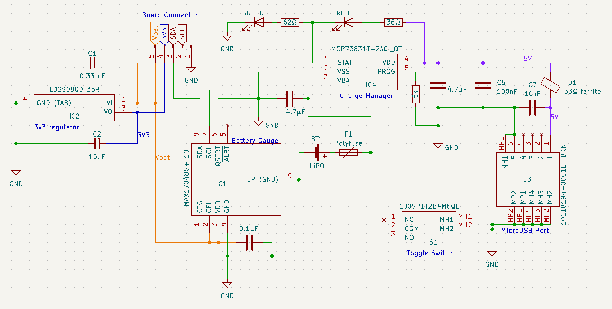

## Members
Devin Cress, Electrical Engineering (2025)
dcress94@vt.edu

Alex Betz, Electrical Engineering (2025)
abetz01@vt.edu

## Repo Link

## Photo

## Mentor
Henry Forsyth

## Current Status
Hardware development

## Project Overview

The Modular Amateur Rocket Computer, or MARC, is an ARM-based flight computer for use in high-powered amateur rockets. The computer will continously monitor and log linear acceleration, rotation, altitude, and compass heading, as well as deploy recovery devices and ignite additional stage motors.

As this is a long-term project and we would like to add additional features in the future (namely telemetry), a modular design has been chosen in which multiple boards are stacked and interconnected via header pins. Four header pins will supply 3.3V, ground, and two I2C lines to every board in the stack, allowing new hardware additions without completely redesigning everything.

The MARC will eventually be used in the high powered rocket that we are developing alongside this project - the Lima II.

## Educational Value Added

MARC is being developed from the ground up and includes IC selection, PCB design, PCB assembly, and firmware design.

## Tasks

- Design sensor board.
- Design power board.
- Order sensor and battery boards.
- Test boards with STM32 development board.

- Design and order main processor board.
- Develop STM32 firmware.

## Design Decisions

- STM32F4 was chosen for its low-cost, performance, and availability.
- LSM6DSO32XTR was chosen for its acceleration range (+/-32g)

## Design Misc

## Steps for Documenting Your Design Process

## BOM + Component Cost
Sensor Board
- 1 Accelerometer/gyrometer IC - LSM6DSO32XTR
- 1 Magnetometer IC - IIS2MDCTR
- 1 Barometer IC - BMP390
- 1 4-pin passthrough header
- 6 100nF 0603 ceramic capacitors
- 1 220nF 0603 ceramic capacitor
- 1 10uF 0805 ceramic capacitor

Power Board
- 1 1000mAh LiPo battery - ASR00012
- 1 3v3 low-dropout voltage regulator - LD29080DT33R
- 1 I2C battery gauge IC - MAX17048
- 1 LiPo battery charge IC - MCP73831T
- 1 MicroUSB port - 10118194
- 2 0803 LEDs
- Various resistors and capacitors

Main Processor Board
- 1 STM32F401RET7
- 1 SRAM IC
- 1 MicroSD card slot - 104031-0811
- 3 n-channel MOSFETs
- 3 screw headers
- 1 piezo buzzer - CMI-9705-0380-SMT-TR
- 5 dip switches

## Timeline

### Fall Semester
- Design and order sensor and power boards.
- Test boards via dev board.
- Develop firmware flow diagram.

### Winter
- Design and order main processor board.
- Begin developing STM32 firmware.

## Useful Links

## Log

### September 2023

- Completed the power board schematic
  

