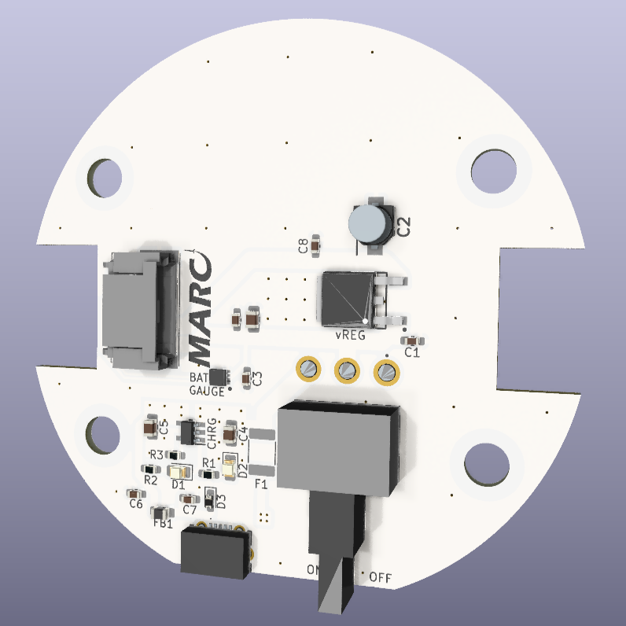
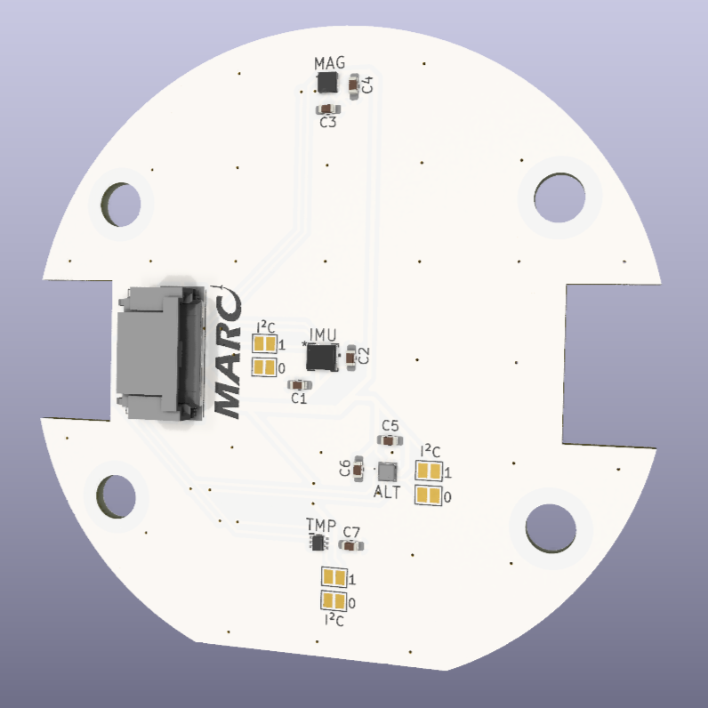

## Members
Devin Cress, Electrical Engineering (2025)
dcress94@vt.edu

Alex Betz, Electrical Engineering (2025)
abetz01@vt.edu

## Repo Link

## Photo

## Mentor
Henry Forsyth

## Current Status
Hardware development

## Project Overview

The Modular Amateur Rocket Computer, or MARC, is an ARM-based flight computer for use in high-powered amateur rockets. The computer will continously monitor and log linear acceleration, rotation, altitude, and compass heading, as well as deploy recovery devices and ignite additional stage motors.

As this is a long-term project and we would like to add additional features in the future (namely telemetry), a modular design has been chosen in which multiple boards are stacked and interconnected via header pins. Five header pins will supply battery voltage, 3.3V, ground, and two I2C lines to every board in the stack, allowing new hardware additions without a complete system redesign.

The MARC will eventually be used in the high powered rocket that we are developing alongside this project - the Lima II.

## Educational Value Added

MARC is being developed from the ground up and includes IC selection, PCB design, PCB assembly, and firmware design.

## Tasks

- Assemble power and sensor boards.
- Bench test power board.
- Test sensors with STM32 development board.
- Develop firmware flow diagram.

- Design and order main processor board.
- Develop STM32 firmware.

## Design Decisions

- A stacking design was chosen to simplify testing and to allow for future expansion.
- A round board design makes maximum use of space within the rocket airframe.
- STM32F401RET7 was chosen for its low-cost, performance, availability, and SDIO interface.
- LSM6DSO32XTR (the accelerometer/gyroscope) was chosen for its acceleration range (+/-32g).
- BMP390 (the altimeter) was chosen for its low noise and high accuracy.
- MOLEX DuraClik connectors were chosen for inter-board connections due to their polarization and locking features.

## Design Misc

## Steps for Documenting Your Design Process

## BOM + Component Cost
### Sensor Board
- 1 Accelerometer/gyrometer IC - LSM6DSO32XTR
- 1 Magnetometer IC - IIS2MDCTR
- 1 Barometer IC - BMP390
- 2 MOLEX DuraClik connectors
- Various resistors and capacitors

### Power Board
- 1 1000mAh LiPo battery - ASR00012
- 1 3v3 low-dropout voltage regulator - LD29080DT33R
- 1 I2C battery gauge IC - MAX17048
- 1 LiPo battery charge IC - MCP73831T
- 1 MicroUSB port - 10118194
- 1 Mini toggle switch
- 2 0803 LEDs
- 1 Ferrite bead
- 1 TVS diode
- 1 PTC fuse
- 2 5-pin MOLEX DuraClik connectors
- 1 2-pin MOLEX DuraClick connector
- Various resistors and capacitors

### Main Processor Board
- 1 STM32F401RET7
- 1 SRAM IC
- 1 MicroSD card slot - 104031-0811
- 3 n-channel MOSFETs - DMG3402L-7
- 4 screw headers
- 1 piezo buzzer - CMI-9705-0380-SMT-TR
- 1 5-channel dip switche - DS04-254-1-05BK-SMT

## Timeline

### Fall Semester
 ✓ Design and order sensor and power boards.
- Test boards via development board.
- Develop firmware flow diagram.

### Winter
- Design and order main processor board.
- Begin developing STM32 firmware.

## Useful Links

## Log

### September 2023

- Completed the power board schematic and PCB.
- PCB ordered.
  
 

- Completed the sensor board schematic and PCB.
- PCB ordered.

 
